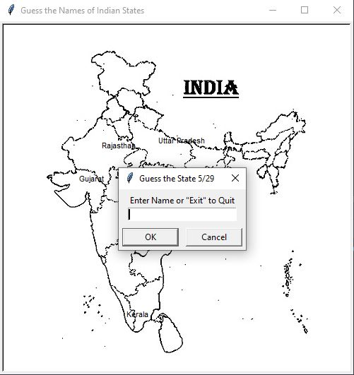

# Indian-States-Name-Guessing-Quiz-In-Python
A simple quiz where you have to guess the name of Indian States. Program written in Python.

  

# Game Play
Enter the name of a state, without worrying about the case of text.  
If it is correct, the state name will be displayed on the map, if not, nothing will happen.  
You can enter 'exit' or 'Exit' to quit the game.  
If you have guessed all of the states, the game will automatically quit.  
The states that you have missed will be stored in a list separately for you to view and learn them. If you haven't missed any, no file is created.

# Guid to Build this Projects

<h4> Step 1: Structure </h4>

  You need to create only one python file, main.py  
  You need a blank map, which needs to be of gif format. The projects uses python turtle for GUI, which recognized only gif format images.

<h4> Step 2: Setting up the Screen </h4>

  Import the turtle library. From this, use Screen class to create a screen object. Give it a title, a certain size that fits your map. Then use addshape() and shape() methods of screen object and turtle library respectively to have an image on the screen.

<h4> Step 3: Setting up the Coordinates </h4>

  Use onscreenclick(func) to get the (x,y) coordinates of the points on the screen, where we want to display state names. The function passed to the screen listener will automatically get x and y points as arguments, which we just print and then store them under x and y columns in a CSV file in front of their respective state names under State column.

<h4> Step 4: Creating list of states </h4>

  Import pandas library, and use its methods to read the CSV file created in Step 3 and create a list of states out of it, using to_list method on dataframe.
  Now create an empty list, that stores the correct guesses that user will make. Set up a while loop which will run as long as the length of <em>correct_guesses</em> list is less than 29, as there are 29 states in India.

<h4> Step 5: User Input </h4>

  Use textinput method of screen object to create a input field, in which user will write his guess. This will be the first part of while loop. If the user wants to exit, create a list containing names of states that the user missed by comparing <em>states</em> list and <em>correct_guesses</em> list. Create a dictionary with only one key:value as 'State': missing_states list. Create a dataframe out of and store as a separate csv.  
  Check if user input is an item of <em>states</em> list, if it is, extract its x and y cooridnates from <em>data</em> dataframe. Use them to make turtle goto those cooridnates and write the states name. Append the user guess in <em>correct_guesses</em> list.

<h4> Step 6: Game Over </h4>

  Outside the loop, calculate user score and evaluate performance. Clear the screen and show the result to him.

